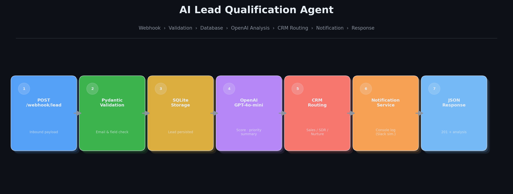
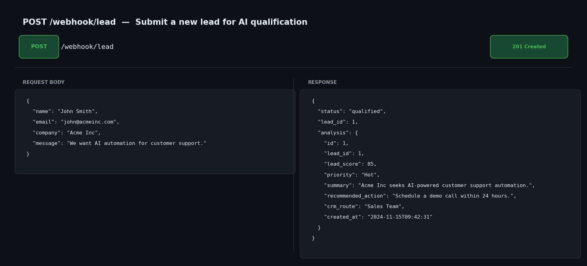
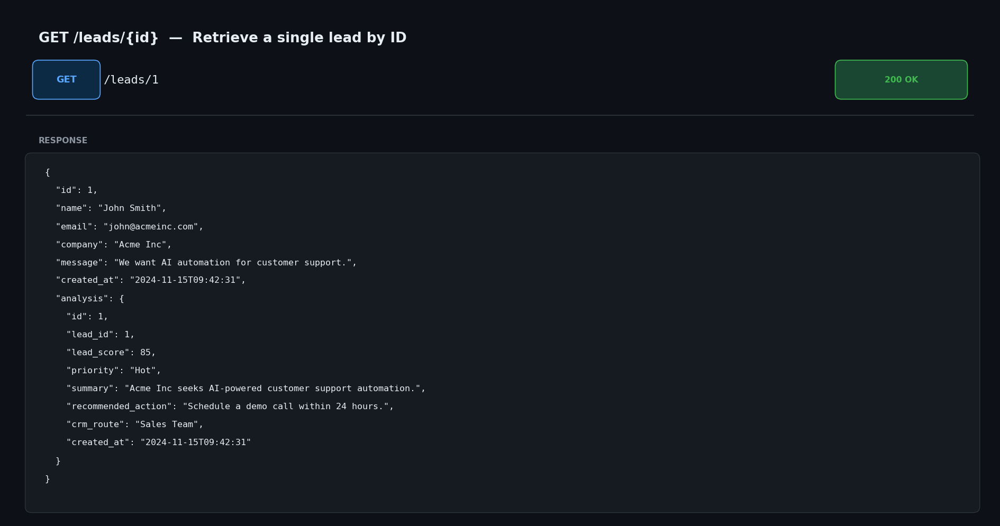
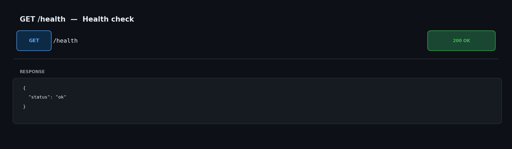

# AI Lead Qualification Agent

An automated lead qualification system built with FastAPI. Inbound leads arrive via webhook, get scored and analysed by OpenAI, routed to the appropriate sales team, and trigger a notification — all in a single API call.

## Architecture



| Step | Component | What it does |
|------|-----------|--------------|
| 1 | `POST /webhook/lead` | Receives the inbound lead payload |
| 2 | Pydantic Validation | Validates required fields and email format |
| 3 | SQLite Storage | Persists the lead via SQLAlchemy |
| 4 | OpenAI GPT-4o-mini | Scores the lead and returns structured JSON |
| 5 | CRM Routing | Assigns a sales route based on the score |
| 6 | Notification Service | Logs a simulated Slack alert to the console |
| 7 | JSON Response | Returns `201` with the full analysis |

## Tech Stack

| Layer        | Technology          |
|--------------|---------------------|
| API          | FastAPI             |
| Database     | SQLite + SQLAlchemy |
| Validation   | Pydantic v2         |
| AI           | OpenAI gpt-4o-mini  |
| Tests        | Pytest + httpx      |

## Project Structure

```
app/
├── main.py                       # App entry point, route registration
├── database.py                   # SQLAlchemy engine and session
├── models/
│   └── lead.py                   # Lead and LeadAnalysis ORM models
├── schemas/
│   └── lead.py                   # Pydantic request/response schemas
├── routes/
│   ├── webhook.py                # POST /webhook/lead
│   └── leads.py                  # GET /leads, GET /leads/{id}
├── services/
│   ├── openai_service.py         # OpenAI integration + response parsing
│   ├── crm_service.py            # Score-based routing logic
│   └── notification_service.py  # Console notification simulation
└── tests/
    ├── conftest.py               # In-memory DB fixtures, TestClient setup
    └── test_leads.py             # Full test suite
```

## Setup

### 1. Clone and enter the project

```bash
git clone <repository-url>
cd ai-lead-qualification-agent
```

### 2. Create a virtual environment

```bash
python -m venv venv
# macOS / Linux
source venv/bin/activate
# Windows
venv\Scripts\activate
```

### 3. Install dependencies

```bash
pip install -r requirements.txt
```

### 4. Configure environment variables

```bash
cp .env.example .env
```

Open `.env` and set your OpenAI API key:

```env
OPENAI_API_KEY=sk-...
```

### 5. Run the server

```bash
uvicorn app.main:app --reload
```

API available at: `http://localhost:8000`  
Interactive docs: `http://localhost:8000/docs`

## Running Tests

```bash
pytest -v
```

Tests use an in-memory SQLite database and mock the OpenAI API, so no API key or network access is required.

## API Reference

### Postman Collection

Import [`docs/postman_collection.json`](docs/postman_collection.json) into Postman, set the `base_url` variable to `http://localhost:8000`, and all four requests are ready to run.

---

### `POST /webhook/lead`

Receive a lead and run the full qualification workflow.

**Request body:**

```json
{
  "name": "John Smith",
  "email": "john@company.com",
  "company": "Acme Inc",
  "message": "We want AI automation for customer support."
}
```

**Response `201`:**

```json
{
  "status": "qualified",
  "lead_id": 1,
  "analysis": {
    "id": 1,
    "lead_id": 1,
    "lead_score": 85,
    "priority": "Hot",
    "summary": "Acme Inc seeks AI-powered customer support automation.",
    "recommended_action": "Schedule a demo call with an account executive.",
    "crm_route": "Sales Team",
    "created_at": "2024-01-15T10:30:00"
  }
}
```

**Error `422`** — missing or invalid fields in the request body.  
**Error `502`** — OpenAI qualification failed.



---

### `GET /leads`

Returns all leads with their analysis, newest first.

**Response `200`:**

```json
[
  {
    "id": 1,
    "name": "John Smith",
    "email": "john@company.com",
    "company": "Acme Inc",
    "message": "We want AI automation for customer support.",
    "created_at": "2024-01-15T10:30:00",
    "analysis": { ... }
  }
]
```

---

### `GET /leads/{id}`

Returns a single lead by ID.

**Response `200`:** Lead object with nested analysis.  
**Response `404`:** `{"detail": "Lead not found"}`



---

### `GET /health`

```json
{"status": "ok"}
```



## Generating Documentation Assets

To regenerate the architecture diagram and API showcase images:

```bash
python generate_assets.py
```

This requires `matplotlib` (included with Anaconda / `pip install matplotlib`) and writes five PNGs to `docs/`.

---

## CRM Routing Logic

| Score    | Route             |
|----------|-------------------|
| 80 – 100 | Sales Team        |
| 50 – 79  | SDR Queue         |
| 0 – 49   | Nurture Campaign  |

## Notification Example

When a lead is qualified, the following is printed to the console (simulating a Slack alert):

```
[NOTIFICATION]
New Hot Lead
Company: Acme Inc
Score: 85
Route: Sales Team
```
